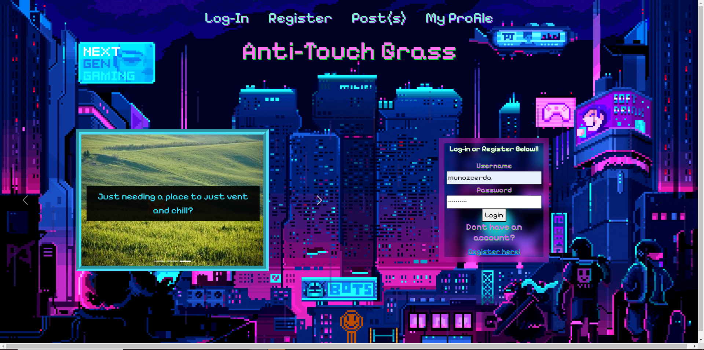

# Enjoy the Microblog Project and the MicroblogLite API!

Don't forget to read the [*MicroblogLite* API docs](http://microbloglite.us-east-2.elasticbeanstalk.com/docs) and experiment with the API in *Postman!*

Practice and experimentation provide experience, and experience provides confidence.

##Log-in
Using bootstrap I made a functioning carsouel. On this page you cannt access the post or profile page wihtout logging in!

##Register
Using the POST method I am able to create(register) a new profile. 

##Posts
Once you are logged in you are able to see the post page. Here we can see everyone else's posts. I wanted to keep the posts organized in a liner way, so I didnt try to put them side by side. 

##My-Profile
This page is only able to be accessed when you are logged in. In the javascript i added -usernameElement.textContent = data.username;- in -function showProfile(data)-, so that which ever account is logged in, the username is displayed.  

